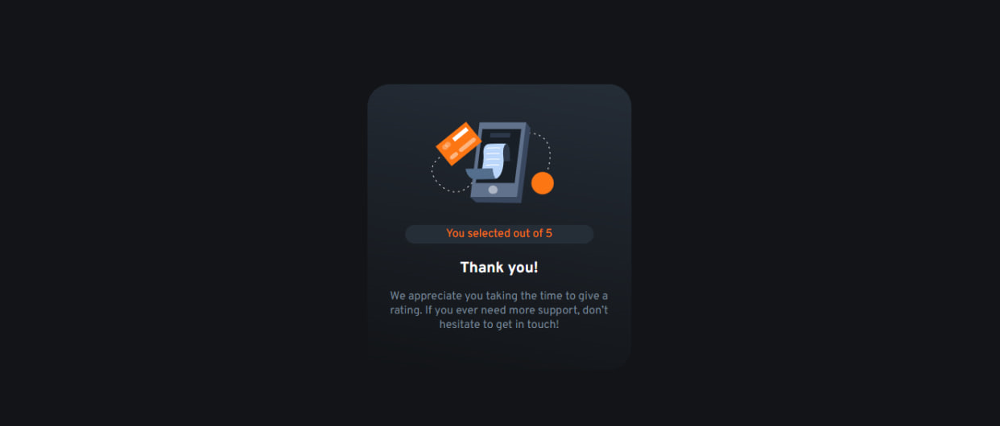

# Frontend Mentor - Interactive rating component solution

This is a solution to the [Interactive rating component challenge on Frontend Mentor](https://www.frontendmentor.io/challenges/interactive-rating-component-koxpeBUmI). Frontend Mentor challenges help you improve your coding skills by building realistic projects. 

## Table of contents

- [Overview](#overview)
  - [The challenge](#the-challenge)
  - [Screenshot](#screenshot)
  - [Links](#links)
- [My process](#my-process)
  - [Built with](#built-with)
  - [What I learned](#what-i-learned)
  - [Continued development](#continued-development)
  - [Useful resources](#useful-resources)
- [Author](#author)
- [Acknowledgments](#acknowledgments)

## Overview

### The challenge

Users should be able to:

- View the optimal layout for the app depending on their device's screen size
- See hover states for all interactive elements on the page
- Select and submit a number rating
- See the "Thank you" card state after submitting a rating

### Screenshot




### Links

- Solution URL: [My solution URL](([https://www.frontendmentor.io/solutions/interactive-rating-component-2mbr-Nz9Ft))
- Live Site URL: [My live site URL ]([https://your-live-site-url.com](https://francisorocha.github.io/interactive-rating-component-main/))

## My process

### Built with

- Semantic HTML5 markup
- CSS custom properties
- Flexbox
- CSS Grid
- Mobile-first workflow
- DOM - JavaScript

### What I learned

By creating an interactive grading component, I sure learned a lot of exciting things. First, I improved my skills in frontend development, it was great to see how the combination of HTML, CSS and JavaScript can bring an interactive component to life! Additionally, I deepened my JavaScript knowledge by implementing the logic behind each user interaction, such as rating star clicks.

También aprendí sobre la importancia de diseñar componentes reutilizables. Dividir la funcionalidad en partes pequeñas y modulares no solo hizo que mi código fuera más limpio, sino que también lo hizo más fácil de mantener y adaptar en futuros proyectos.

Personalizar el componente fue otra gran lección. Añadir opciones para cambiar el número de estrellas, los colores y otros aspectos me mostró la importancia de la flexibilidad y la adaptabilidad en el diseño de interfaces de usuario.

Y no puedo olvidar el aspecto de las pruebas y la depuración. Aprender a probar mi componente en diferentes escenarios y solucionar errores me hizo sentir más seguro en mi habilidad para crear software robusto y confiable.

Por último, compartir mi componente con la comunidad y recibir comentarios y sugerencias fue una experiencia valiosa. No solo me ayudó a mejorar el componente, sino que también me conectó con otros desarrolladores y me permitió aprender de sus experiencias.

En resumen, crear un componente de calificación interactivo fue una experiencia increíble que me ayudó a crecer como desarrollador frontend y a comprender mejor el proceso de diseño y desarrollo de software.

```html
<h1>Some HTML code I'm proud of</h1>
```
```css
.proud-of-this-css {
  color: papayawhip;
}
```
```js
const proudOfThisFunc = () => {
  console.log('🎉')
}
```

### Continued development

Modern frameworks: I would like to delve into the use of modern frameworks such as React.js, Vue.js or Angular to develop more complex and scalable web applications. Although I am familiar with the basics of these frameworks, there is still a lot to learn about their advanced features and best practices.

Advanced CSS: I want to improve my CSS skills to be able to create more complex and attractive designs without depending so much on predefined style libraries. This includes mastering concepts like flexbox, grid layout, CSS animations, and responsive design techniques.

Web Accessibility: Accessibility is essential to ensure that all users, regardless of their abilities, can access and use my web applications. I would like to learn more about web accessibility guidelines and how to implement them effectively in my projects.

Performance Optimization: While I am aware of the importance of performance optimization in web development, I would like to delve into specific techniques to improve loading time, code efficiency, and overall user experience.

Automated Testing: I want to learn how to write automated tests for my components and frontend applications using tools like Jest, Enzyme or Cypress. This would help me detect errors faster and ensure code quality over time.

### Useful resources

- [Color Selector](https://htmlcolorcodes.com/es/) - This resource helped me select the colors for the design

- [UIgradients](https://uigradients.com/#Anamnisar) - This resource helped me make a very neutral gradient

- [CSS Tricks](https://css-tricks.com/snippets/css/complete-guide-grid/) - This resource helped me understand a little more about the position and how to use flex-box

- [Lenguaje JS](https://lenguajejs.com/javascript/dom/que-es/) - This resource helped me understand and delve deeper into the DOM


## Author

- Frontend Mentor - [@FrancisoRocha](https://www.frontendmentor.io/profile/FrancisoRocha)
- Twitter - [@franciscoangel751](https://www.instagram.com/franciscoangel751?igsh=MTl0YXkxbmYzeTRpbg%3D%3D&utm_source=qr)
- GitHub - [@FrancisoRocha](https://github.com/FrancisoRocha)
